# Architecture
High-level map of the system: one component diagram (what talks to what) and one
sequence diagram (what happens during a single question). Both stay at the same
level of granularity - the shape of the system, not its internals. For file-by-file
detail see the [Layout section of the README](README.md#layout); for why things are
built this way, see [`agent_docs/decisions.md`](agent_docs/decisions.md).

## Components

```mermaid
flowchart TD
    subgraph Entry["Entrypoints"]
        CLI["adk run / adk web<br/>(ADK CLI)"]
        UI["Streamlit UI"]
        Eval["Evaluation harness<br/>(scored sweeps)"]
    end

    subgraph Loop["root_agent - LoopAgent (phase 4)"]
        Agent["research_agent<br/>Plan → Execute → Synthesize<br/>(holds the instruction and the tools)"]
        Critique["critique_agent<br/>names one gap, or calls exit_loop"]
    end

    Budget["tool_budget<br/>per-turn ceiling on evidence calls"]

    subgraph Evidence["Evidence tools - answer 'what is true'"]
        DocTool["Document Search Tool"]
        FinTool["Financial Data Tool"]
        WebTool["Web Search Tool<br/>(sub-agent + google_search)"]
        NewsTool["News Agent Tool<br/>(A2A client)"]
    end

    subgraph Output["Output tool - terminal, gathers nothing"]
        Canvas["Canvas<br/>markdown / html / code"]
    end

    subgraph KB["Knowledge base (built offline via python -m src.dataset)"]
        Raw["data/raw/*.pdf"]
        Parse["Parse (Docling)"]
        Chunk["Chunk"]
        Embed["Embed (Gemini embeddings)"]
        Index["FAISS index (in-memory)"]
    end

    subgraph Ext["External services"]
        Vertex["Vertex AI<br/>(chat + embedding models)"]
        MCP["MCP fetch server<br/>(Docker, spawned per call)"]
        Yahoo["Yahoo Finance<br/>(3 hardcoded pages)"]
        GSearch["Google Search grounding"]
        NewsSvc["News Agent service<br/>(own process, A2A + agent card)"]
    end

    Obs["Langfuse tracing<br/>(instruments every entrypoint)"]

    CLI --> Loop
    UI --> Loop
    Eval --> Loop
    Loop -. instrumented by .-> Obs

    Agent --> Critique
    Critique -. follow-ups, next cycle .-> Agent
    Agent -. every tool call checked by .-> Budget

    Agent --> DocTool --> Index
    Agent --> FinTool --> MCP --> Yahoo
    Agent --> WebTool --> GSearch
    Agent --> NewsTool --> NewsSvc --> GSearch
    Agent --> Canvas
    Agent --> Vertex
    NewsSvc --> Vertex

    Raw --> Parse --> Chunk --> Embed --> Index
    Embed --> Vertex

    click UI "src/ui/app.py" "Streamlit chat UI"
    click Eval "src/evaluation/run_eval.py" "evaluation runner"
    click Agent "src/research_agent/agent.py" "research_agent: instruction + tool wiring"
    click Critique "src/research_agent/critique.py" "critique agent and loop control"
    click Budget "src/research_agent/tool_budget.py" "per-turn tool-call ceiling"
    click DocTool "src/tools/document_search.py" "Document Search Tool"
    click FinTool "src/tools/financial_data.py" "Financial Data Tool"
    click WebTool "src/tools/web_search.py" "Web Search Tool"
    click NewsTool "src/tools/news_agent.py" "A2A client tool"
    click Canvas "src/tools/canvas.py" "Canvas output tool"
    click NewsSvc "src/news_service/server.py" "News Agent A2A service"
    click Index "src/retrieval/faiss_store.py" "FAISS build/load"
    click Vertex "src/services/genai_client.py" "shared Vertex AI client"
```


Three things in that diagram carry most of the design:

- **`root_agent` is the loop, not the planner.** Since phase 4 it is a `LoopAgent` over
  `[research_agent, critique_agent]`, and `research_agent` is the LLM that holds the
  instruction and the tools. This matters whenever a turn's output is read: each agent
  emits its own "final response", and the answer is `research_agent`'s.
- **Evidence tools and the output tool are different kinds of thing.** The four evidence
  tools answer "what is true" and count against the per-turn ceiling. Canvas produces
  rather than retrieves, is terminal, and is therefore exempt from that ceiling and from
  the redundancy metric (ADR-0016).
- **The News Agent is a separate process, reached over A2A.** The main agent never imports
  it - it discovers the agent through its published agent card and calls it across a
  process boundary, which is the whole point of phase 5 (ADR-0018).

| Component | File |
|---|---|
| Entrypoints (CLI) | `adk run` / `adk web` - see [README Setup](README.md#setup) |
| Entrypoints (UI) | [`src/ui/app.py`](src/ui/app.py) |
| Entrypoints (evaluation) | [`src/evaluation/run_eval.py`](src/evaluation/run_eval.py) |
| root_agent (the loop) + research_agent | [`src/research_agent/agent.py`](src/research_agent/agent.py) |
| critique_agent, loop control, per-turn state | [`src/research_agent/critique.py`](src/research_agent/critique.py) |
| Tool-call ceiling | [`src/research_agent/tool_budget.py`](src/research_agent/tool_budget.py) |
| Document Search Tool | [`src/tools/document_search.py`](src/tools/document_search.py) |
| Financial Data Tool | [`src/tools/financial_data.py`](src/tools/financial_data.py) |
| Web Search Tool | [`src/tools/web_search.py`](src/tools/web_search.py) |
| News Agent Tool (A2A client) | [`src/tools/news_agent.py`](src/tools/news_agent.py) |
| News Agent service | [`src/news_service/server.py`](src/news_service/server.py) |
| Canvas (output tool) | [`src/tools/canvas.py`](src/tools/canvas.py) |
| Eval schema, metrics, replay | [`src/evaluation/`](src/evaluation) |
| Corpus | [`data/raw/`](data/raw) |
| Parse (Docling) | [`src/ingestion/parse.py`](src/ingestion/parse.py) |
| Chunk | [`src/ingestion/chunk.py`](src/ingestion/chunk.py) |
| Embed | [`src/embedding/embedder.py`](src/embedding/embedder.py) |
| FAISS index | [`src/retrieval/faiss_store.py`](src/retrieval/faiss_store.py) |
| Index build entrypoint | [`src/dataset.py`](src/dataset.py) |
| Shared Vertex AI client | [`src/services/genai_client.py`](src/services/genai_client.py) |
| Config (models, paths, GCP project) | [`src/config.py`](src/config.py) |

GitHub strips `click` bindings from rendered Mermaid diagrams (security sandboxing), so the
table above is the reliable link path there; `click` works in editors/tools that render
Mermaid with default settings (e.g. the Mermaid Live Editor, most IDE previews).

## One turn, end to end
```mermaid
sequenceDiagram
    participant User
    participant Loop as root_agent loop
    participant Agent as research_agent
    participant Tool as Evidence tool
    participant Canvas
    participant Critique as critique_agent

    User->>Loop: question
    activate Loop
    Loop->>Loop: reset per-turn state (budget, follow-ups)
    loop research cycle, bounded by the critique budget
        Loop->>Agent: run
        activate Agent
        Agent->>Agent: plan: which single source per fact?<br/>answer or deliverable?
        loop per fact
            Agent->>Tool: call (counted against the ceiling)
            Tool-->>Agent: result
        end
        Agent->>Agent: synthesize: answer strictly from results, cite each fact
        opt a deliverable was asked for
            Agent->>Canvas: title, format, sections, citations
            Canvas-->>Agent: rendered artefact + path
        end
        Agent-->>Loop: draft (the turn's answer)
        deactivate Agent
        Loop->>Critique: review the draft, or the artefact if one was produced
        alt a specific gap remains
            Critique-->>Loop: follow-up sub-question, another cycle
        else complete
            Critique-->>Loop: exit_loop
        end
    end
    Loop-->>User: answer, plus the artefact if there is one
    deactivate Loop
```

Routing is mutually exclusive per fact by design (see the planner instruction in
`agent.py`): knowledge-base questions go to Document Search, live stock/crypto/currency
questions to the Financial Data Tool, "latest news on a topic" to the News Agent, and
everything else public to Web Search. A fact only uses more than one source when the
question genuinely requires combining evidence across them.

Two bounds keep a turn finite, and both live in code rather than in the instruction
because prompt wording repeatedly failed to hold them (ADR-0009, ADR-0015): a per-turn
ceiling on evidence calls, and a two-tier bound on the loop - a hard `max_iterations` plus
a per-request `critique_budget`. A budget of 0 collapses the loop to a single research
cycle and reproduces the pre-phase-4 flow exactly, which is what makes it the baseline arm
the evaluation compares against.
