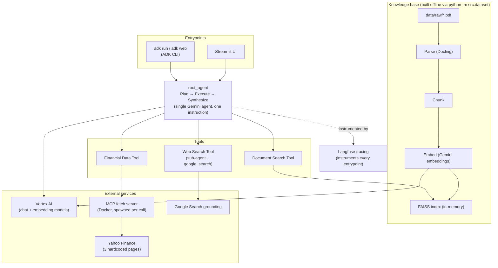
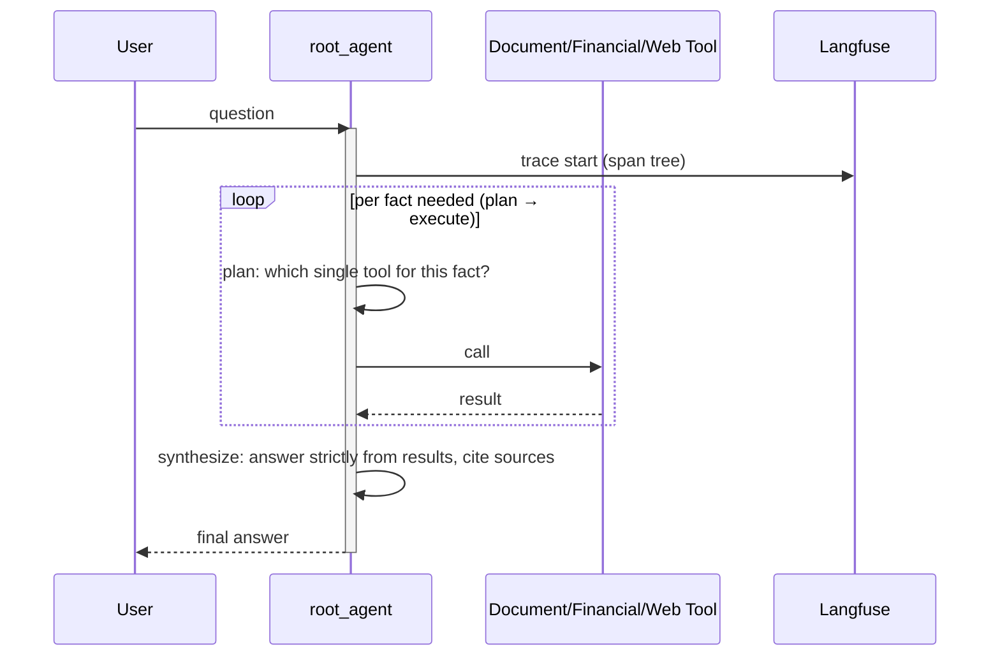

# Architecture
High-level map of the system: one component diagram (what talks to what) and one
sequence diagram (what happens during a single question). Both stay at the same
level of granularity - the shape of the system, not its internals. For file-by-file
detail see the [Layout section of the README](README.md#layout); for why things are
built this way, see [`agent_docs/decisions.md`](agent_docs/decisions.md).

## Components

| Component | File |
|---|---|
| Entrypoints (CLI) | `adk run` / `adk web` - see [README Setup](README.md#setup) |
| Entrypoints (UI) | [`src/ui/app.py`](src/ui/app.py) |
| root_agent (plan-execute-synthesize) | [`src/research_agent/agent.py`](src/research_agent/agent.py) |
| Document Search Tool | [`src/tools/document_search.py`](src/tools/document_search.py) |
| Financial Data Tool | [`src/tools/financial_data.py`](src/tools/financial_data.py) |
| Web Search Tool | [`src/tools/web_search.py`](src/tools/web_search.py) |
| Corpus | [`data/raw/`](data/raw) |
| Parse (Docling) | [`src/ingestion/parse.py`](src/ingestion/parse.py) |
| Chunk | [`src/ingestion/chunk.py`](src/ingestion/chunk.py) |
| Embed | [`src/embedding/embedder.py`](src/embedding/embedder.py) |
| FAISS index | [`src/retrieval/faiss_store.py`](src/retrieval/faiss_store.py) |
| Index build entrypoint | [`src/dataset.py`](src/dataset.py) |
| Shared Vertex AI client | [`src/services/genai_client.py`](src/services/genai_client.py) |
| Config (models, paths, GCP project) | [`src/config.py`](src/config.py) |

GitHub strips `click` bindings from rendered Mermaid diagrams (security sandboxing), so the
table above is the reliable link path there; `click` works in editors/tools that render
Mermaid with default settings (e.g. the Mermaid Live Editor, most IDE previews).

## One turn, end to end

The three tools are mutually exclusive per fact by design (see the planner instruction in
`agent.py`): knowledge-base questions go to Document Search, live stock/crypto/currency
questions go to the Financial Data Tool, everything else public goes to Web Search. A fact
only uses more than one tool when the question genuinely requires combining evidence across
sources.
